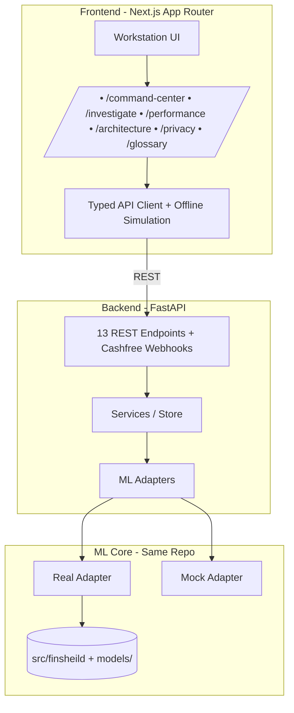
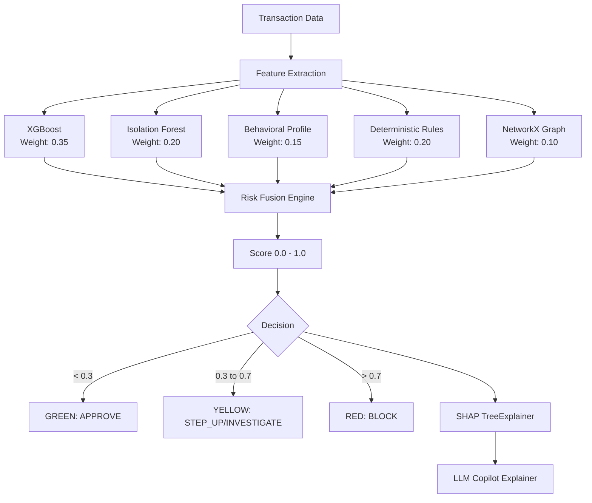
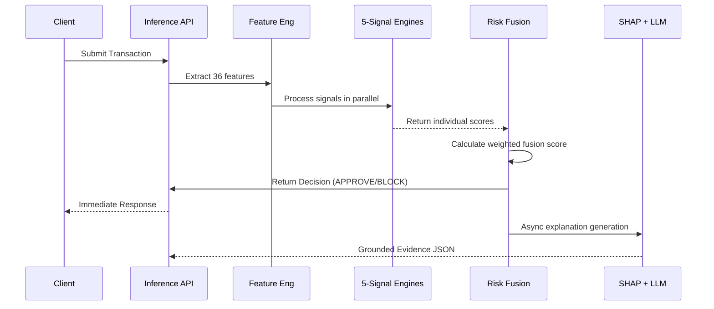
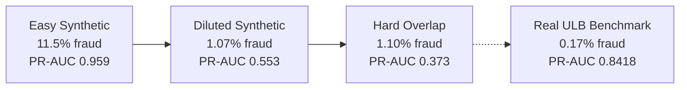

<div align="center">

# FinShield

**Real-Time, Multi-Signal Fraud Defense for Digital Payments — ML Engine + API + Dashboard in One Repo**


</div>

## Overview

FinShield scores every payment across **five independent signals** — XGBoost (supervised), Isolation Forest (anomaly), behavioral profiling, 8 deterministic rules, and a NetworkX entity graph — fused into one calibrated risk score (APPROVE / STEP_UP / INVESTIGATE / BLOCK). **SHAP** explains each decision mathematically; an instruction-tuned LLM copilot narrates the evidence for analysts.

Three layers, one repo: `src/finsheild/` (research + training engine), `backend/` (FastAPI, 13 endpoints incl. live Cashfree webhooks), `frontend/` (Next.js 16 + React 19 investigation workstation).

> [!IMPORTANT]
> The LLM copilot acts purely as an observability and explainability layer. It provides context to fraud analysts but **never** overrides the deterministic or ML-driven risk scores.

## Run the Demo (2 Minutes)

**Live hosted demo (no install):** https://finshield-app.vercel.app — runs fully offline on the built-in simulation.

Or run the full stack locally:

```bash
pip install -r requirements.txt
bash start_app.sh
```

Open **http://127.0.0.1:5173** → Command Center → inject a **Fraud Ring** → click it for the forensic view (risk radar, SHAP bars, copilot, entity graph). Or fire a gateway payment yourself from the Cashfree studio tab (₹75 scores LOW, ₹1,00,000 scores CRITICAL). API docs at **http://127.0.0.1:8000/docs**. Full guide: `docs/app.md`.

## How the Full Stack Works Together



---

## Architecture & Data Flow

FinSheild relies on five distinct evaluation signals to holistically assess transaction risk:
1. **XGBoost Supervised Model**: Primary pattern recognition engine (500 trees).
2. **Isolation Forest**: Unsupervised anomaly detection trained solely on legitimate behavior (0.05 contamination).
3. **Behavioral Profiling**: Per-user baselines measuring deviation scores.
4. **Deterministic Rules**: 8 configurable hard-coded heuristics.
5. **Graph Analysis (NetworkX)**: Evaluates user ↔ account ↔ device ↔ merchant cliques for shared-device velocity and ring detection.

### Signal Fusion Architecture



### Data Flow Sequence



---

## Performance Evaluation

The core supervised model was trained and evaluated on the real-world **Kaggle ULB Credit Card Fraud Dataset**.

- **Dataset Specs**: 284,807 transactions, 492 fraud cases (0.17% fraud rate).
- **Split Strategy**: 70% Train / 15% Validation / 15% Test (Seed 42).
- **Preprocessing**: StandardScaler fitted exclusively on the training split to prevent data leakage.

### Real ULB Benchmark Results

| Model | ROC-AUC | PR-AUC | F1-Score | Precision | Recall |
|-------|---------|--------|----------|-----------|--------|
| **XGBoost** (FinSheild) | **0.9709** | **0.8418** | **0.8467** | **0.9206** | **0.7838** |
| Logistic Regression (Baseline) | 0.9495 | 0.7005 | 0.7407 | - | - |

*XGBoost Confusion Matrix: True Negatives: 42,643 | False Positives: 5 | False Negatives: 16 | True Positives: 58*

### Synthetic Stress Tests

To ensure robustness against shifting fraud patterns, the model is tested against varying synthetic scenarios with different class overlaps and imbalances.



*Note: The "Hard Overlap" scenario is intentionally designed to be more difficult than real-world conditions.*

---

## Deterministic Rules & Risk Weights

The Fusion Engine combines signals using the following weights:
- **XGBoost**: 35%
- **Isolation Forest**: 20%
- **Deterministic Rules**: 20%
- **Behavioral Profiling**: 15%
- **Network Graph**: 10%

**8 Configurable Deterministic Rules**:
1. `high_velocity`: ≥5 transactions in 5 minutes
2. `burst_velocity`: ≥8 transactions
3. `new_device_high_value`: Amount > $500 on a new device
4. `unusual_amount_zscore`: Amount > 3σ from user mean
5. `offhours_high_value`: Amount > $1000 during off-hours
6. `shared_device`: Device linked to multiple disjoint accounts
7. `location_anomaly`: High geographic distance from usual profile
8. `rapid_country_switch`: Impossibly fast travel between transactions

---

## Project Structure

```text
Finsheild/
├── backend/              # FastAPI app (13 endpoints, auto-discovers ML core)
├── frontend/             # Next.js 16 + React 19 + Tailwind workstation
├── start_app.sh          # one-click launcher (backend :8000 + frontend :5173)
├── src/finsheild/
│   ├── data/           # loader, preprocessing, stratified splits
│   ├── model.py        # model registry: logreg, xgboost (500 trees), lightgbm
│   ├── train.py        # training pipeline with early stopping + threshold tuning
│   ├── inference.py    # batch and single-row inference
│   ├── evaluation.py   # PR-AUC, ROC-AUC, confusion matrix, reports
│   ├── features/       # 36 leakage-safe cols (transactional, behavioral, velocity, device, location)
│   ├── behavioral/     # per-user profiles + deviation scoring
│   ├── anomaly/        # IsolationForest (0.05 contamination, trained on legit only)
│   ├── rules/          # 8 configurable deterministic rules with severity levels
│   ├── graph/          # NetworkX: user↔account↔device↔merchant shared-device cliques
│   ├── risk_fusion/    # weighted 5-signal fusion → GREEN/YELLOW/RED decision
│   ├── explain/        # SHAP TreeExplainer + grounded evidence generation
│   ├── synthetic_env/  # synthetic fraud scenario generator (entities, transactions, hard overlap)
│   ├── llm_data/       # evidence→JSON copilot instruction-tuning dataset generator
│   ├── llm_eval/       # base vs finetuned LLM evaluation
│   ├── finetune/       # QLoRA r=8, 4-bit quantization, checkpoint resume
│   ├── compare_llm/    # base vs finetuned comparison
│   └── export/         # export_all pipeline artifacts
├── models/             # trained model weights (XGBoost, scaler, thresholds)
├── evaluation/         # reports (JSON/MD) and figures (PR/ROC curves, confusion matrices)
├── tests/ + backend/tests/  # 215 unit/integration/API tests
├── scripts/            # dataset download, synthetic generation, experiment runners
├── notebooks/colab/    # Colab notebooks for GPU training
├── config/             # dataset.yaml configuration
└── docs/               # detailed documentation
```

---

## Quickstart

### Setup Environment

```bash
# Initialize virtual environment
python3 -m venv .venv 
source .venv/bin/activate

# Install dependencies and dev tools
pip install -r requirements.txt 
pip install -e ".[dev]"
```

### Run Pipeline

```bash
# 1. Download the Real ULB Dataset
python scripts/download_dataset.py

# 2. Train the XGBoost Model
python -m finsheild.train --model xgboost

# 3. Run the test suite (215 tests: ML core + backend API)
pytest -q
```

## Full-Stack App

`backend/` (FastAPI — 13 endpoints: health, metrics, scoring, generation, investigation, graph, identity, Cashfree webhooks, demo reset) + `frontend/` (Next.js 16 + React 19 + Tailwind) sit in this repo. The backend auto-discovers the ML core in the repo root (override with `FINSHEILD_CORE_PATH`); without model artifacts it serves honest `DEMO_FALLBACK` labels.

```bash
# One-click launcher (backend :8000 + frontend :5173)
bash start_app.sh

# Backend only
PYTHONPATH=. python -m uvicorn backend.main:app --reload

# Frontend only
cd frontend; npm install; npm run dev

# Backend API tests
pytest backend/tests/ -q
```

Full guide (screens, endpoints, demo walkthrough): `docs/app.md`.

---

## Tech Stack

- **Machine Learning**: scikit-learn, XGBoost, LightGBM, IsolationForest
- **Graph & Analysis**: NetworkX, pandas
- **Explainability**: SHAP
- **LLM Finetuning**: Qwen2.5-0.5B-Instruct, PEFT (LoRA r=8), TRL SFTTrainer, bitsandbytes (4-bit quantization), transformers
- **Backend**: FastAPI, Pydantic v2, Uvicorn
- **Frontend**: Next.js 16 (App Router), React 19, Tailwind CSS
- **Engineering**: pytest, joblib, kagglehub, hatchling

---

## Limitations & Roadmap

- **Streaming Ingestion**: The current inference engine supports batch and single-row processing. Direct Kafka/Kinesis streaming integration is planned.
- **Graph Scalability**: NetworkX is suitable for the current research scale; migration to a distributed graph database (e.g., Neo4j or Amazon Neptune) will be required for enterprise-scale deployments.
- **LLM Latency**: The LLM copilot currently runs asynchronously due to inference latency.

---

## Author

Built by **Riddhi Bantia** — ML engine, API, and frontend in this repo.

## License

This project is licensed under the MIT License.
