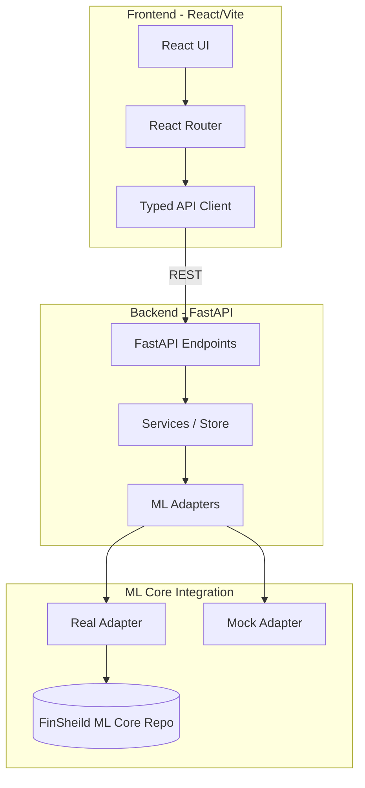

<div align="center">

# 🛡️ FinSheild App

**The real-time operational dashboard and forensic investigation workstation for the FinSheild fraud intelligence platform.**

[](https://reactjs.org/)
[](https://www.typescriptlang.org/)
[](https://vitejs.dev/)
[](https://tailwindcss.com/)
[](https://fastapi.tiangolo.com/)
[](https://www.python.org/)
[](https://opensource.org/licenses/MIT)

</div>

## 📖 Overview

This repository contains the presentation and investigation layer (React frontend + FastAPI backend) for the **FinSheild** fraud detection platform, built as a hackathon project. 

It provides fraud analysts with a comprehensive toolkit: instant transaction scoring, 5-signal risk fusion breakdowns, SHAP-powered explainability, entity graph forensics, and an AI investigation copilot.

> [!IMPORTANT]
> This app lives in the same repo as the ML core (`backend/` + `frontend/` next to `src/finsheild/`). The backend auto-discovers the ML root in the repo (override with `FINSHEILD_CORE_PATH`); without model artifacts it serves honest `DEMO_FALLBACK` labels.

## 🏗️ Architecture



ML Core = `src/finsheild/` in this repo (XGBoost + risk fusion, `models/` artifacts).

### Directory Structure

```text
Finsheild/                      # single repo: ML core + full-stack app
├── backend/
│   ├── main.py               # FastAPI app (13 REST endpoints incl. Cashfree webhooks)
│   ├── schemas.py             # Pydantic contracts (Transaction, ScoreResult, CopilotResponse)
│   ├── config.py              # ML Core auto-discovery (repo root, FINSHEILD_CORE_PATH override)
│   ├── metrics_loader.py      # Real benchmark metrics ingestion
│   ├── services/store.py      # In-memory transaction store + scenario generator
│   ├── adapters/
│   │   ├── real_adapter.py    # Connects to trained XGBoost + risk fusion pipeline
│   │   └── mock_adapter.py    # Deterministic demo scorer
│   └── tests/test_api.py      # 7 API contract tests
├── frontend/
│   ├── src/App.tsx             # React Router (5 routes)
│   ├── src/pages.tsx           # Dashboard, Investigation, Performance, Architecture, Privacy
│   ├── src/api.ts              # Typed API client
│   └── src/index.css           # Tailwind CSS dark cyber theme
├── start_app.sh                # One-click launcher (backend :8000 + frontend :5173)
├── src/finsheild/              # ML core (5-signal fusion engine)
└── models/                     # Trained artifacts (XGBoost, scaler, thresholds)
```

## ✨ Key Features & Screens

### 📡 Live Command Center
Real-time transaction stream featuring intuitive risk badges (LOW / MEDIUM / HIGH / CRITICAL). Includes an interactive scenario injector to simulate Normal, Suspicious/ATO, Fraud Ring, or Ambiguous activities instantly.

### 🔍 Forensic Investigation View
Deep-dive analysis interface featuring:
- **5-Signal Risk Fusion Radar:** XGBoost (35%), Anomaly (20%), Rules (20%), Behavioral (15%), Graph (10%).
- **SHAP Explanations:** Feature attribution bars explaining the "why" behind the score.
- **AI Investigation Copilot:** Generates grounded narratives based on engine evidence.

> [!NOTE]
> **Data Honesty Design:** The UI transparently labels the data source (`LIVE_MODEL` vs `DEMO_FALLBACK`). The LLM Copilot is restricted to explaining evidence—it *never* sets or overrides the risk score itself.

### 📈 Model Performance Observatory
Live ingestion of real ULB benchmark metrics (ROC-AUC, PR-AUC) and visualization of synthetic experiment comparisons across varying difficulty distributions (Easy → Diluted → Hard Overlap).

### 🕸️ Entity Graph Forensics
Visualizes complex relationships (User ↔ Account ↔ Device ↔ Merchant) to expose device-sharing rings and mule account chains.

### 🔐 Privacy & Identity Tokenization
Demonstrates secure handling of PII using salted SHA-256 tokenization and active phone masking.

## 🚀 Quick Start

### The One-Click Launcher

```bash
bash start_app.sh
```
* **Backend:** http://127.0.0.1:8000 (Swagger docs at `/docs`)
* **Frontend:** http://127.0.0.1:5173

### Manual Setup

**Backend (from repo root):**
```bash
pip install -r requirements.txt
PYTHONPATH=. python -m uvicorn backend.main:app --reload
```

**Frontend:**
```bash
cd frontend
npm install
npm run dev
```

## 🔌 ML Core Integration

The backend auto-discovers the ML core in the repo root (`src/finsheild/`, `models/`).
* To override the location, set the `FINSHEILD_CORE_PATH` environment variable.
* If model artifacts are missing, the backend gracefully downgrades to the `MockMLAdapter` (with honest `DEMO_FALLBACK` labels).

## 🧭 10-Step Demo Walkthrough

1. Navigate to the **Live Command Center**.
2. Observe the real-time stream of incoming transactions.
3. Use the **Scenario Injector** to spawn a "Fraud Ring" transaction.
4. Click on the injected transaction to open the **Forensic Investigation View**.
5. Examine the **Risk Fusion Radar** to see the 5-signal breakdown.
6. Review the **SHAP** feature attribution bars.
7. Consult the **AI Copilot** for a narrative explanation of the risk factors.
8. Switch to the **Entity Graph** tab to visualize the device-sharing network.
9. Visit the **Privacy** tab to observe PII tokenization.
10. Finally, check the **Performance Observatory** for live benchmark metrics.

## 🧰 API Reference

| Endpoint | Method | Description |
|---|---|---|
| `/api/health` | GET | System health check |
| `/api/model/metrics` | GET | Retrieve model performance metrics |
| `/api/model/status` | GET | Check ML Core connection status |
| `/api/transaction/score` | POST | Score a single transaction |
| `/api/transactions/generate` | POST | Generate a batch using `?scenario=...` |
| `/api/transactions` | GET | Fetch recent transactions |
| `/api/transactions/{id}` | GET | Get details of a specific transaction |
| `/api/investigation/explain` | POST | Get AI Copilot narrative explanation |
| `/api/graph/{txn_id}` | GET | Retrieve entity graph relationships |
| `/api/identity/{user_id}` | GET | Retrieve tokenized user identity details |
| `/api/webhooks/cashfree` | POST | Live Cashfree payment-gateway ingress |
| `/api/webhooks/cashfree/simulate` | POST | Simulated Cashfree webhook for demos |
| `/api/demo/reset` | POST | Reset the in-memory data store |

## 🧪 Testing

The backend includes 7 contract tests verifying:
- Health and metrics endpoints
- Generate and investigate flow
- Correct risk ordering
- AI Copilot score restrictions
- Graph and identity label verification

Run tests with:
```bash
pytest backend/tests/ -q
```

Frontend build stability is verified via `npm run build`.

## 📄 License

This project is licensed under the MIT License.
